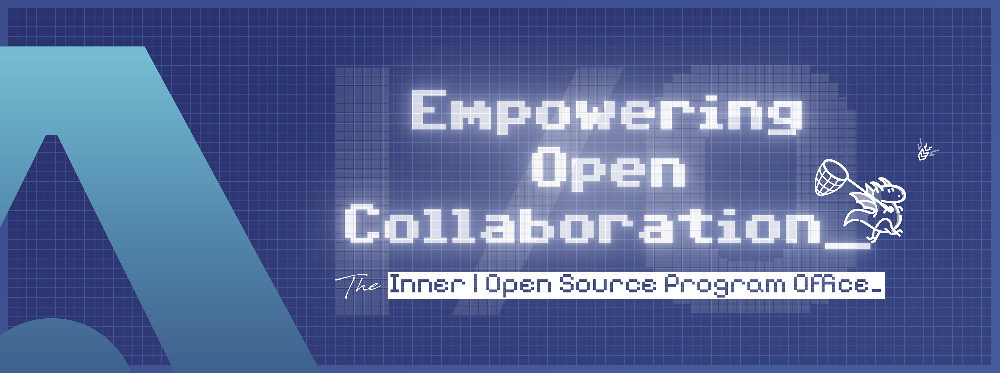

# Hi there, I'm Sébastien Lejeune 👋

## 📡 Currently

- 💼 **Thales Open Source Director** at [Thales](https://thalesgroup.com) — building and running the Group's Inner & Open Source Program Office
- 🔭 Disseminating Open Source practices across Thales: governance, foundations, communities, hackathons
- 🏆 Proud of the team's **"Best Open Source Strategy"** award (CNLL, Open Source Experience, Dec 2025)
- 🎸 Guitar player · ♟️ Chess enthusiast · 🎵 70's rock & metal

📫 Reach me at **sebastien.lejeune@thalesgroup.com**
